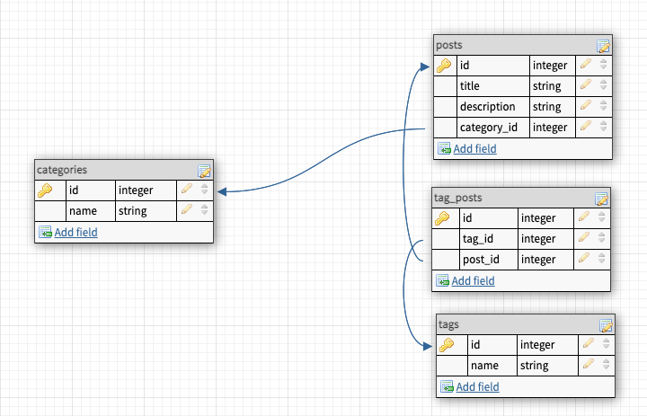

# Flask Craigslist

# Overview

| http verb | route | notes |
| --------- | -------------------------- | ------------------------------------------------------ |
| GET | / | just says 'ok' |
| GET | /categories | get all existing categories |
| GET | /categories/:id | get info on a single existing category |
| POST | /categories/:id/posts | create a new post inside an existing category |
| GET | /tags | get a list of existing tags |
| PUT | /tags/:tagId/posts/:postId | associate an existing post with an existing tag |
| GET | /tags/:tagId/posts | see a list of all posts that are associated with a tag |
| GET | /posts/:id/tags | see a list of all tags that are associated with a post |
| DELETE | /posts/:id | delete a post |

# Setup

1. Clone down the repo & cd into it
1. python3 -m venv virt-env to set up a virtual environment folder in this project
1. activate your virtual environment (different commands for mac vs windows). your pip3 list should be mostly empty
   - mac: source virt-env/bin/activate
1. pip3 install -r requirements.txt; this is like npm i after cloning down an express repo. It downloads everything in requirements.txt
1. create the database in psql and name it flask_craigslist
1. make sure you're in your virtual environment still and run alembic upgrade head
1. python3 application.py and you should be good to go!

## Directions

1. reference the overview above to create functions for each route
1. HOWEVER before you do anything you should create a route for '/seed'
1. for the /seed route we want you to create a function that will prepopulate your categories and tags (sort of mimicking a seed file) (think part 1 of the apartments homework )
1. you can create whatever categories and tags you want just make sure to only hit this route ONCE or else you'll create multiple entries!!
1. after you've prepopulated your categories and tags comment out the /seed route and the function so you don't accidently hit it again
